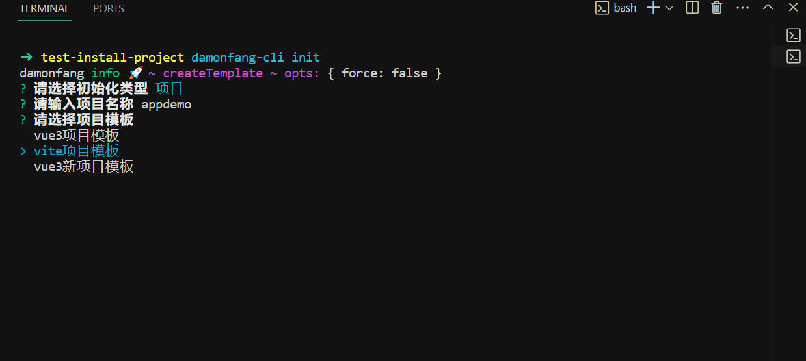
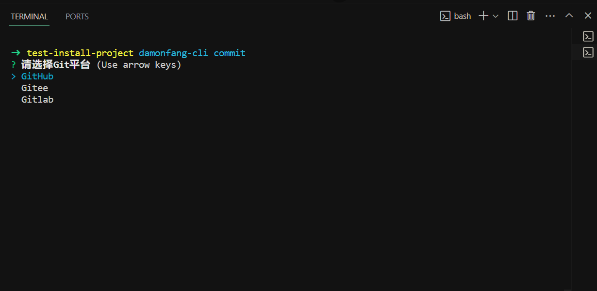
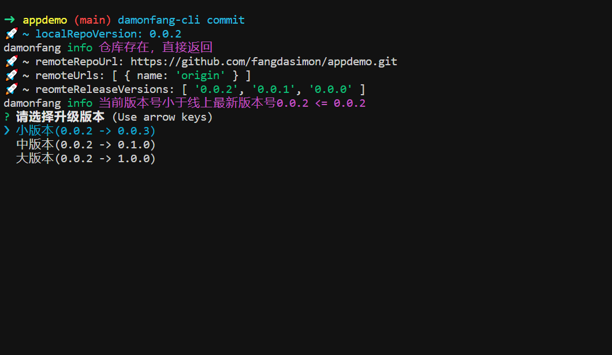
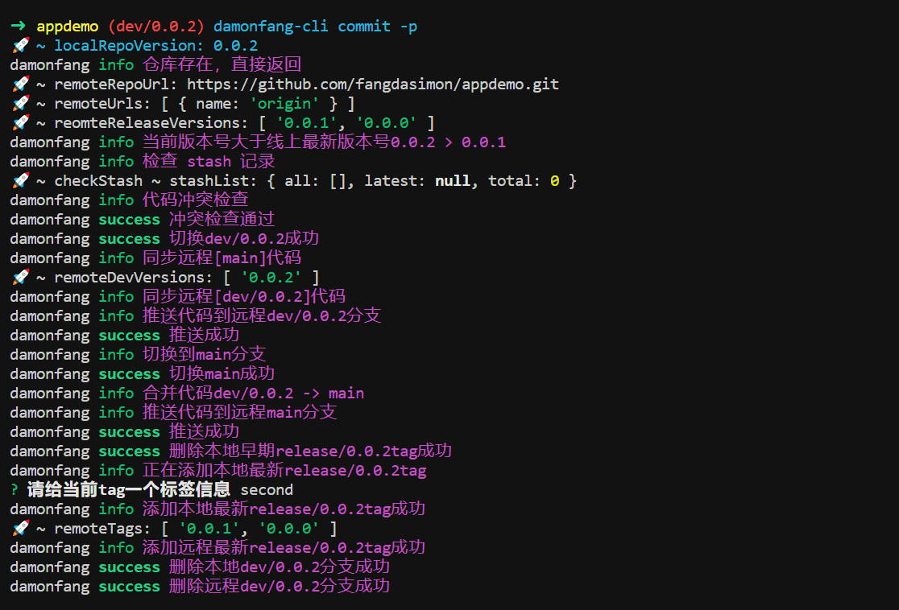

# 介绍
@damonfang/cli是一个交互式命令行工具，能够快速构建项目进行业务开发，并且支持多平台的自动化提交和发布代码。

**选择模板**

**选择平台**

**选择版本**

**发布版本**

## 安装
::: tip
Node 版本要求: v16.18.0或更高版本
:::

安装：
npm install -g @damonfang/cli

## 使用

### 语法
~~~js
1. [init example]: 选择一个模板
damonfang-cli init 
## or
damonfang-cli init <aaa> -t project -tp template-vite -pr aaa -tr test-aaa
2. [commit example]: 提交代码到代码平台
damonfang-cli commit
3. [publish example]: 给当前版本打上tag, 并且使用平台的CICD服务进行自动化发布
damonfang-cli commit -p
~~~

### 前置要求
1. 由于脚手架支持自动化提交代码，而自动化提交是基于代码平台开放的open api服务实现的，它可以帮助我们通过请求交互的方式去管理和创建仓库，能请求交互的条件就是需要我们先登录代码平台，赋予权限生成令牌信息，在之后的交互中使用令牌去请求从而自动化管理我们的仓库代码。
    - [github平台的令牌获取](https://github.com/settings/tokens)
    - [gitee平台的令牌获取](https://gitee.com/profile/personal_access_tokens)
    - gitlab平台的令牌获取: 登录你的gitlab,然后在profile/personal_access_tokens下面获取

2. 如果需要使用平台的CICD服务进行自动化构建和部署，需要满足一些基本条件
  
    - 需要在本地配置yml文件，例如github actions, gitlab.yml，告诉平台进行命令式构建
    - 需要在平台项目里配置和服务器相关的一些基本信息，方便对打包后的代码进行操作
    - 有时平台提供的免费构建机器处理很慢，就需要我们在自己的服务器上下载一个处理CI作业的工具来进行专门构建

###  配置说明
~~~js
  用法: damonfang-cli [command] [options]
  command: init commit
  init选项：
    -t,  --type <type>                    模板类型
    -tp, --template <template>            选择模板
    -pr, --proDeployDir <proDeployDir>    服务器上的生产目录
    -tr, --testDeployDir <testDeployDir>  服务器上的测试目录
  commit选项：
    -c  --cache <cache>                   清空git相关信息
    -p  --publish <publish>               自动发布
~~~

## 示例
<Video src="./scafflod.mp4"/>